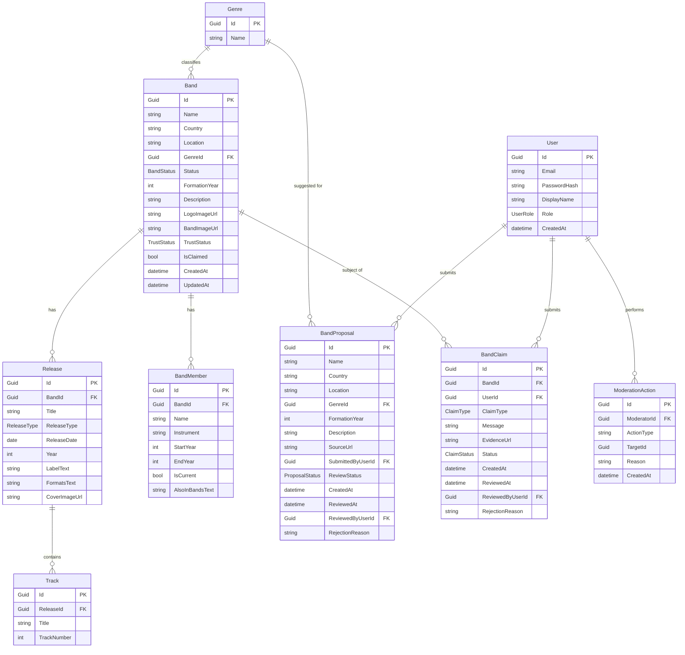

# Domain Entity Relationship Diagram

```mermaid
erDiagram
	User {
		Guid Id PK
		string Email
		string PasswordHash
		string DisplayName
		UserRole Role
		datetime CreatedAt
	}

	Genre {
		Guid Id PK
		string Name
	}

	Band {
		Guid Id PK
		string Name
		string Country
		string Location
		Guid GenreId FK
		BandStatus Status
		int FormationYear
		string Description
		string LogoImageUrl
		string BandImageUrl
		TrustStatus TrustStatus
		bool IsClaimed
		datetime CreatedAt
		datetime UpdatedAt
	}

	Release {
		Guid Id PK
		Guid BandId FK
		string Title
		ReleaseType ReleaseType
		date ReleaseDate
		int Year
		string LabelText
		string FormatsText
		string CoverImageUrl
	}

	Track {
		Guid Id PK
		Guid ReleaseId FK
		string Title
		int TrackNumber
	}

	BandMember {
		Guid Id PK
		Guid BandId FK
		string Name
		string Instrument
		int StartYear
		int EndYear
		bool IsCurrent
		string AlsoInBandsText
	}

	BandProposal {
		Guid Id PK
		string Name
		string Country
		string Location
		Guid GenreId FK
		int FormationYear
		string Description
		string SourceUrl
		Guid SubmittedByUserId FK
		ProposalStatus ReviewStatus
		datetime CreatedAt
		datetime ReviewedAt
		Guid ReviewedByUserId FK
		string RejectionReason
	}

	BandClaim {
		Guid Id PK
		Guid BandId FK
		Guid UserId FK
		ClaimType ClaimType
		string Message
		string EvidenceUrl
		ClaimStatus Status
		datetime CreatedAt
		datetime ReviewedAt
		Guid ReviewedByUserId FK
		string RejectionReason
	}

	ModerationAction {
		Guid Id PK
		Guid ModeratorId FK
		string ActionType
		Guid TargetId
		string Reason
		datetime CreatedAt
	}

	Genre ||--o{ Band : "classifies"
	Genre ||--o{ BandProposal : "suggested for"

	Band ||--o{ Release : "has"
	Band ||--o{ BandMember : "has"
	Band ||--o{ BandClaim : "subject of"

	Release ||--o{ Track : "contains"

	User ||--o{ BandProposal : "submits"
	User ||--o{ BandClaim : "submits"
	User ||--o{ ModerationAction : "performs"
```
