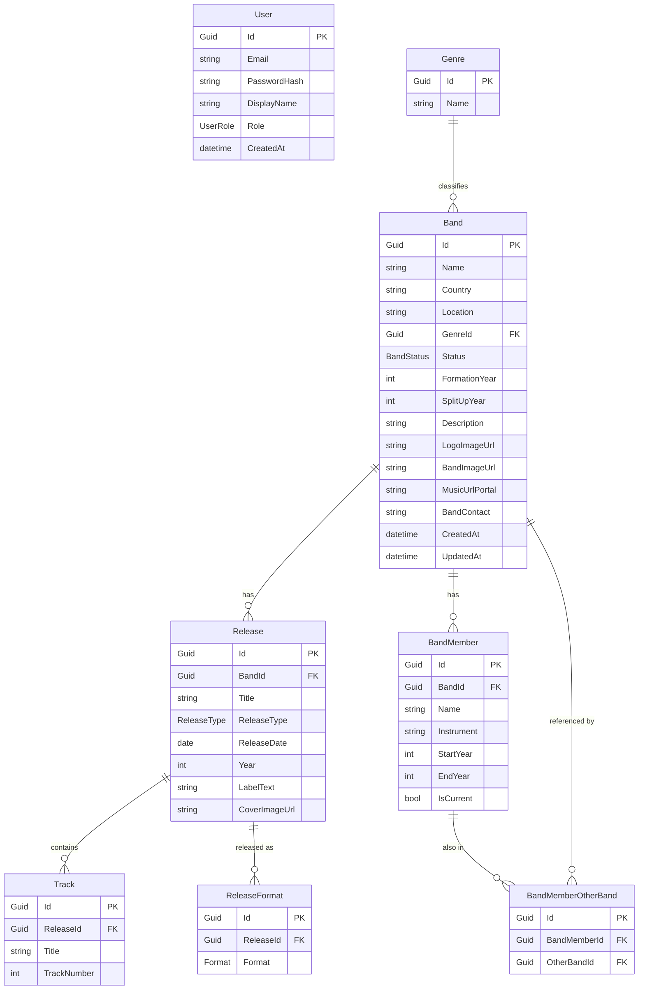

# Domain Entity Relationship Diagram


```mermaid
erDiagram
	User {
		Guid Id PK
		string Email
		string PasswordHash
		string DisplayName
		UserRole Role
		datetime CreatedAt
	}

	Genre {
		Guid Id PK
		string Name
	}

	Band {
		Guid Id PK
		string Name
		string Country
		string Location
		Guid GenreId FK
		BandStatus Status
		int FormationYear
		int SplitUpYear
		string Description
		string LogoImageUrl
		string BandImageUrl
		string MusicUrlPortal
		string BandContact
		datetime CreatedAt
		datetime UpdatedAt
	}

	Release {
		Guid Id PK
		Guid BandId FK
		string Title
		ReleaseType ReleaseType
		date ReleaseDate
		int Year
		string LabelText
		string CoverImageUrl
	}

	ReleaseFormat {
		Guid Id PK
		Guid ReleaseId FK
		Format Format
	}

	Track {
		Guid Id PK
		Guid ReleaseId FK
		string Title
		int TrackNumber
	}

	BandMember {
		Guid Id PK
		Guid BandId FK
		string Name
		string Instrument
		int StartYear
		int EndYear
		bool IsCurrent
	}

	BandMemberOtherBand {
		Guid Id PK
		Guid BandMemberId FK
		Guid OtherBandId FK
	}

	Genre ||--o{ Band : "classifies"

	Band ||--o{ Release : "has"
	Band ||--o{ BandMember : "has"

	Release ||--o{ Track : "contains"
	Release ||--o{ ReleaseFormat : "released as"

	BandMember ||--o{ BandMemberOtherBand : "also in"
	Band ||--o{ BandMemberOtherBand : "referenced by"

```
```
